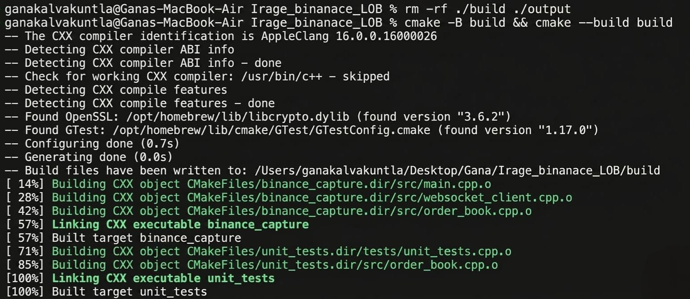
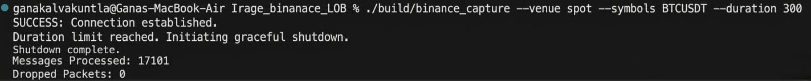
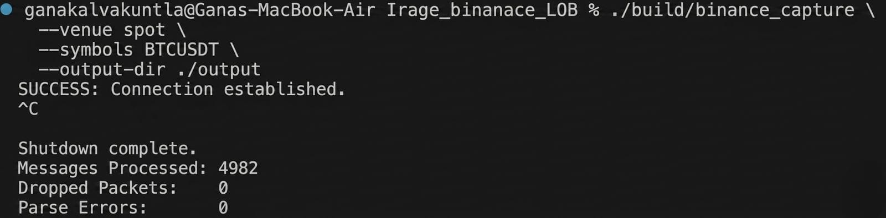
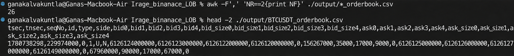
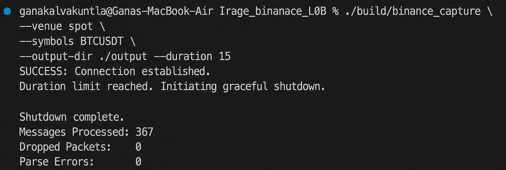
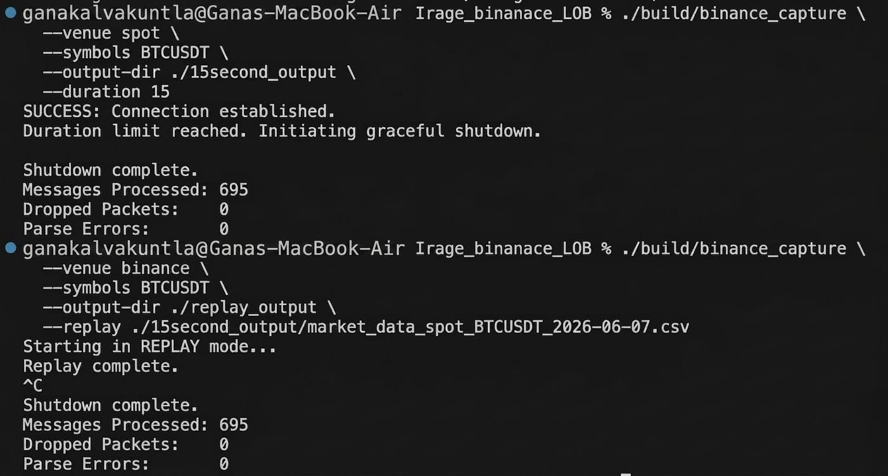

# Binance WebSocket Capture & Local Order Book (LOB)

C++ engine to capture real-time Binance market data, maintain a synchronized Local Order Book (LOB), and emit audit-compliant CSV snapshots. This project is optimized for low-latency HFT environments, featuring lock-free data handling and deterministic state replay.

## 1. Project Overview & Design 

### Design
* **Threading & I/O:** To achieve low-latency capture, I implemented a producer-consumer architecture using an **SPSC (Single-Producer Single-Consumer) lock-free RingBuffer**. The I/O thread is dedicated strictly to WebSocket reception and buffer-pushing to minimize the critical path's exposure to network jitter. The main processing thread handles JSON parsing, LOB state updates, and asynchronous disk I/O, ensuring that the network stream is never blocked by file system latency.
* **Order Book Semantics** : The engine processes every incoming update as a discrete state change. When a price level's quantity is set to 0, the logic explicitly invokes a map deletion (erase). This ensures that stale or empty price levels are purged immediately, maintaining a "clean" book. By utilizing an ordered map (std::map with std::greater<int64_t> for bids), the system ensures that the Top-5 levels are always retrieved in the correct price-priority order, regardless of the order in which individual updates arrive.
* **Deterministic Scaling: Floating point avoidance** : Standard double types are non-deterministic across different hardware/compiler flags and prone to rounding errors. By scaling all prices and quantities by $10^8$ into int64_t, we achieve bit-exact precision. This is the standard for financial applications to prevent "penny drift" or incorrect execution prices.
* **RFC 4180 Compliance:** Market data audit logs use `|` as a field delimiter. This prevents parsing collisions caused by commas within JSON payloads, ensuring robust CSV extraction.
* **Observability:** The system monitors dropped_packets (buffer full) vs. parse_errors (malformed JSON). This helps diagnose whether bottlenecks are at the Network layer or the Logic layer, allowing for targeted performance tuning.


## 2. Build & Prerequisites

### Prerequisites
* **Compiler:** GCC 14 (or compatible C++17 compiler)
* **Standard:** C++17
* **Build System:** `cmake`, `ninja-build`
* **Dependencies:** `libssl-dev`, `libboost-all-dev`, `zlib1g-dev`

### Compilation
```bash
# Configure and Build
cmake -B build -G Ninja \
  -DCMAKE_BUILD_TYPE=Release \
  -DCMAKE_CXX_COMPILER=g++-14 \
  -DCMAKE_CXX_FLAGS="-Wall -Wextra -O2"
cmake --build build --parallel
```

## 3. Symbols & Stream Configuration

* **User-Facing Format:** Symbols are accepted as uppercase strings (`BTCUSDT`, `ETHUSDT`).
* **API Requirements:** Binance WebSocket streams require all symbols to be **lowercase** in the subscription URL. 
* **Internal Handling:** The engine performs a case-insensitive conversion (`toUpperCase` -> `toLowerCase`) internally to construct valid stream paths, ensuring the user does not need to worry about Binance's specific formatting requirements.

### Stream Aggregation 
The engine utilizes Binance's **Combined Stream** mode to minimize network overhead by multiplexing all data into a single connection. For every symbol provided (`BTCUSDT`), the engine automatically subscribes to:

1. `[symbol]@depth@100ms`: The **Differential Depth** stream. This is used for real-time LOB updates.
2. `[symbol]@depth5@100ms`: The **Partial Top-of-Book Snapshot**. This is used for sanity checks and re-initialization during resync events.
3. `[symbol]@trade`: The **Individual Trade** stream. This captures execution events for audit-trail completeness.

## 4. CLI commands 
### Clean and Build 

Remove existing build and output directories to ensure a fresh start
```bash
rm -rf ./build ./output
```

Configure the build directory and compile the project
```bash
cmake -B build && cmake --build build
```


### Test Capture (Timed)
Run a short 300-second test to ensure the WebSocket connection is established and data is flowing
```bash
./build/binance_capture --venue spot --symbols BTCUSDT --duration 300
```


### Run Production Capture
Execute the capture for target symbols and save the results to the output directory. Capture live data and save to the output folder

```bash
./build/binance_capture \
  --venue spot \
  --symbols BTCUSDT \
  --output-dir ./output
```


This command generates two files: market_data_spot_BTCUSDT.csv (raw audit trail) and BTCUSDT_orderbook.csv (LOB snapshots).

### Verify Data Integrity
Use these commands to confirm that the generated files are formatted correctly and contain the expected data headers.

Inspect the header and the first data row of the audit log
```bash
head -2 ./output/market_data_spot_BTCUSDT.csv
```
Inspect the header and the first data row of the LOB snapshot
```bash
head -2 ./output/BTCUSDT_orderbook.csv
```

Confirm the LOB snapshot file contains the expected 26 data columns
```bash
awk -F',' 'NR==2{print NF}' ./output/BTCUSDT_orderbook.csv
```


## 5. Sample Run - Attached full CSV files for Deliverables A & B 
Attached screenshots of CLI, attached CSV files for the sample run of 1 minute 

**[Sample 1 minute run outputs - Market Data Audit & Order Book Snapshot](./output/)**

### Replay - To perform deterministic grading replay, use the --replay flag. This mode reads market_data_*.csv file and reproduces the exact order book transitions without any external network dependency.

### Perform Live data capture for 15 seconds 

```bash
./build/binance_capture \
  --venue spot \
  --symbols BTCUSDT \
  --output-dir ./output \
  --duration 15
```


### Replay Mode 

Use the generated market_data_spot_BTCUSDT.csv to drive the replay. This forces your application to process the raw packets again, reconstructing the Order Book state in the ./replay_output directory.

```bash
./build/binance_capture \
  --venue binance \
  --symbols BTCUSDT \
  --output-dir ./replay_output \
  --replay ./output/market_data_spot_BTCUSDT.csv
```


**[Replay CSV of 15 second live capture output](./replay_output/)**

The console output confirms the success of the replay, including the number of messages processed and any errors encountered.

## 6. Operational Policies (Market-Data Literacy)

### Timestamp & Scaling Policy

* **Scaling**:  All numerical values are stored as $10^8$ scaled integers.
* **Timestamps**: Arrival time is captured via std::chrono::system_clock at the moment of deserialization. It is recorded as two integers: tsec (seconds since epoch) and tnsec (nanosecond remainder), ensuring nanosecond-level audit resolution.

### Using Fixed-Point Arithmetic
Since Binance provides prices as strings. Converting these directly to double or float introduces IEEE-754 floating-point inaccuracies, which can lead to off-by-one-cent errors in order book matching. By parsing these into int64_t using a $10^8$ multiplier, we ensure:
1. **Deterministic Matching**: Identical inputs across different machines will always yield the same LOB state.
2. **Performance**: Integer arithmetic (add/subtract) is significantly faster than floating-point math on modern CPUs.
3. **Precision**: We maintain absolute decimal accuracy to 8 decimal places, consistent with the exchange's own internal representation.
   
### Reconnects and Gap Handling: Self-Healing
In a production HFT environment, WebSocket connections are not permanent; they drop, lag, and experience sequence gaps. My system is designed with a fail-fast, recover-hard mentality:

* **Handling Sequence Gaps (u / U / pu):** Binance provides sequence numbers in every message (`U` for the first, `u` for the last in the diff). I compare the incoming `U` (the first sequence number in the current update) against my `last_seq + 1`. If there is a mismatch—meaning a packet was lost in transit—the data is immediately considered corrupt. Rather than guessing the state of the book, the system invalidates the current LOB, clears all internal price maps, and enters a resync state, awaiting a fresh `@depth5` snapshot to rebuild a clean foundation.

* **Handling `conn_epoch` Changes:** A change in `conn_epoch` signals that the underlying WebSocket connection has been re-established (a reconnect). When this occurs, the entire state of the previous book is discarded. I treat this as a Day Zero event for that symbol. I clear all maps and ignore incoming differential updates until a new snapshot arrives, ensuring that my Local Order Book never mixes stale, pre-reconnect data with new, post-reconnect data.

* **Why this approach?** In trading, an inaccurate order book is more dangerous than no order book at all. By forcing a clean reset on any sequence discrepancy or connection reset, I guarantee that the snapshots emitted to `*_orderbook.csv` are always mathematically sound and representative of the exchange's true state.

## 7. File Structure
* **main.cpp**: Orchestration layer, signal handling, and core processing loop.
* **order_book.hpp/cpp**: Core LOB logic, price/size map management, and 26-column CSV formatting.
* **ring_buffer.hpp**: Lock-free SPSC buffer facilitating high-throughput data transfer.
* **websocket_client.hpp**: WebSocket lifecycle management and stream subscription.
* **market_data_*.csv**: Raw audit trail of all inbound market events (pipe-delimited).
* ***_orderbook.csv**: 26-column compliant state snapshots (comma-delimited).

